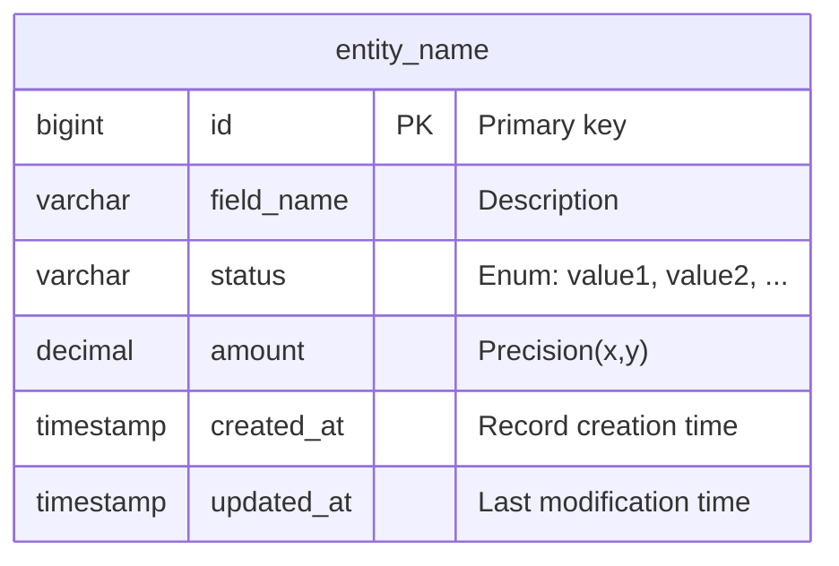

# ER Diagram Conventions

## File Format

Use Mermaid `erDiagram` syntax, saved as `.mermaid` extension.

## Header Comment

```mermaid
%% {Project Name} ER Diagram
%% Version: {version}
%% Entities: {count}
%% Relationships: {count}
%% Generated: {date}
```

**Important:** The counts in the header MUST match the actual entity and relationship counts in the diagram. Always recount after edits.

## Entity Definition Pattern



### Naming Conventions

| Element | Convention | Example |
|---------|-----------|---------|
| Entity name | snake_case, singular | `ledger_account` |
| Field name | snake_case | `merchant_id` |
| Primary key | `id` | `id BIGINT PK` |
| Foreign key | `{entity}_id` | `account_id` |
| Enum field | Describe values in comment | `"Enum: active, frozen, closed"` |
| Timestamp | `{action}_at` | `created_at`, `posted_at` |

### Required Fields

Every entity must include:
- `id` — Primary key (BIGINT)
- `created_at` — Creation timestamp
- `updated_at` — Last update timestamp

Additional common fields as appropriate:
- `status` — Lifecycle state (with enum values in comment)
- `version` — Optimistic locking version (if applicable)

## Relationship Notation

| Cardinality | Syntax | Meaning |
|-------------|--------|---------|
| One-to-one | `\|\|--\|\|` | Exactly one to exactly one |
| One-to-many | `\|\|--o{` | One to zero or more |
| One-to-one-or-more | `\|\|--\|{` | One to one or more |
| Many-to-many | `}o--o{` | Many to many (use junction table instead) |

### Relationship Labels

Always add relationship labels describing the association:

```mermaid
    parent_entity ||--o{ child_entity : "has many"
    child_entity }o--|| parent_entity : "belongs to"
```

## Grouping Strategy

Add section comments to group related entities:

```mermaid
    %% ─── Core Domain ───
    entity_a { ... }
    entity_b { ... }

    %% ─── Supporting Domain ───
    entity_c { ... }
    entity_d { ... }
```

## Verification Checklist

After creating/editing the ER diagram:

- [ ] Header comment entity count matches actual count
- [ ] Header comment relationship count matches actual count
- [ ] Every entity has `id`, `created_at`, `updated_at`
- [ ] All foreign keys have corresponding relationships defined
- [ ] No orphan entities (every entity participates in at least one relationship)
- [ ] Enum fields have value lists in comments
- [ ] Field names match DDL column names exactly
